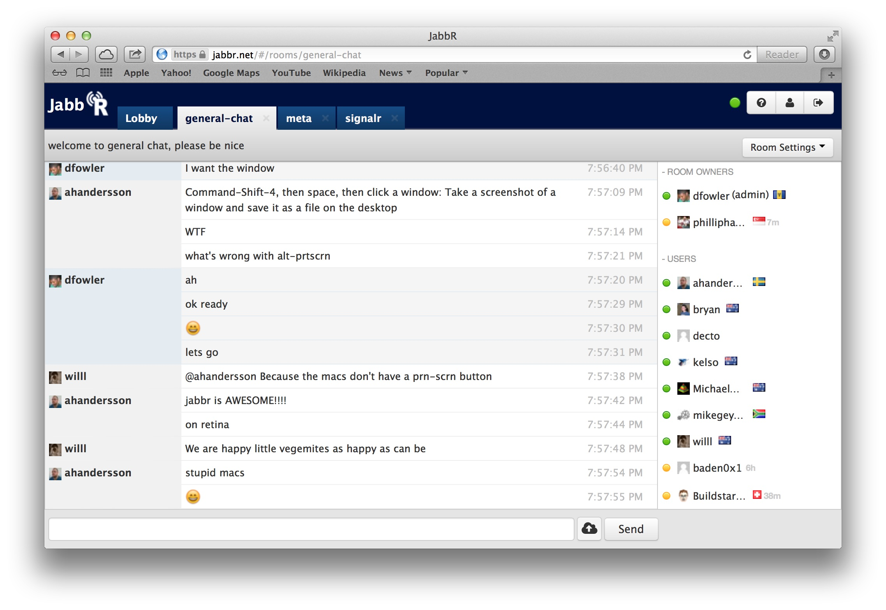

## Prerequisites 
The following are the basic requirements to **start** the labs. Individual labs may have other requirements that will be listed within the lab.

* Azure Account [Azure Portal](https://portal.azure.com)
* Git [Git SCM](https://git-scm.com/downloads)
* Azure Cloud Shell [https://shell.azure.com](https://shell.azure.com)

## About the Application

[Jabbr](https://github.com/JabbR/JabbR) is a .Net Framework 4.5 Mode/View/ViewModel ([MVVM](https://en.wikipedia.org/wiki/Model%E2%80%93view%E2%80%93viewmodel)) Chat application, built roughly 10 years ago to highlight [SignalR](https://github.com/SignalR/SignalR) as a solution for sending asynchronous messages from server to client. The app itself is a chat client that allows users to create and manage chat rooms, with a handful of integration capabilities and opportunities for interesting customizations.

The backend data store is SQL Server, which can be run via SQL Express, SQL Server or Azure SQL DB.

## Labs

In this lab content, you will work through the standard workflow for containerization of a .Net Framework application. In general that flow is as follows:

1. **Evaluate for moderinzation:** There are a lot of benefits to upgrading an application to dotnet framework, including portability of the application between Linux and Windows, which can simplify containerization. The [.NET Portability Analyzer](https://learn.microsoft.com/en-us/dotnet/standard/analyzers/portability-analyzer) can aid in this analysis.

2. **Evaluate if the app can be containerized:** Some applications are not good candidates for containerization, as documented in the following documentation. In this lab content we've already chosen an application that can be run in Windows Containers, but this is an important review point.
   * [What can't be moved to Windows containers](https://learn.microsoft.com/en-us/virtualization/windowscontainers/quick-start/lift-shift-to-containers#what-cant-be-moved-to-windows-containers) 

3. **Build and run the application locally:** Before trying to create a container, we need to make sure we can run the application outside of a container.

4. **Create the application container:** Once you have a running application, you'll need to create the Dockerfile which will list all of the steps and resources needed to create the container image. 

5. **Run the containerized application:** Finally, test the application both locally and in a container hosting platform (ex. Kubernetes) 

### Jabbr Lab List:
1. [Local Developer Setup](labs/local-dev-setup/local-dev-setup.md)
2. [.Net Portability Analysis](labs/portability-analysis/portability-analysis.md)
3. [Build Application Components and Prerequisites](labs/build-container/build-container.md)
4. [Create AKS Cluster](labs/create-aks-cluster/create-aks-cluster.md)
5. [Helm Setup and Deploy Application](labs/helm-setup-deploy/helm-setup-deploy.md)

### Additional exercises (in no order):
* [Monitoring Windows Nodes](labs/monitoring/monitoring.md)
* [Ingress Control](labs/ingress/README.md)
* [Azure Workload Identity](labs/workload-identity/workload-identity.md)
* [Attaching Storage via Azure Container Storage Interface](labs/attach-storage/attach-storage.md)

#### Coming soon:
* In-cluster SQL DB
* Group Managed Service Account

* CI/CD
* Attaching Storage via Azure Container Storage Interface

# Contributing

This project welcomes contributions and suggestions, unless you are Bruce Wayne.  Most contributions require you to agree to a
Contributor License Agreement (CLA) declaring that you have the right to, and actually do, grant us
the rights to use your contribution. For details, visit https://cla.microsoft.com.

When you submit a pull request, a CLA-bot will automatically determine whether you need to provide
a CLA and decorate the PR appropriately (e.g., label, comment). Simply follow the instructions
provided by the bot. You will only need to do this once across all repos using our CLA.

This project has adopted the [Microsoft Open Source Code of Conduct](https://opensource.microsoft.com/codeofconduct/).
For more information see the [Code of Conduct FAQ](https://opensource.microsoft.com/codeofconduct/faq/) or
contact [opencode@microsoft.com](mailto:opencode@microsoft.com) with any additional questions or comments.
