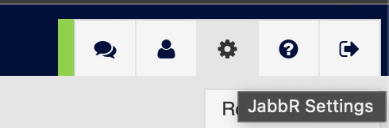
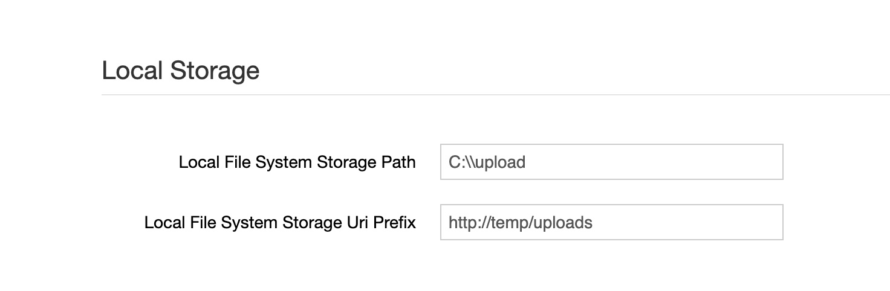
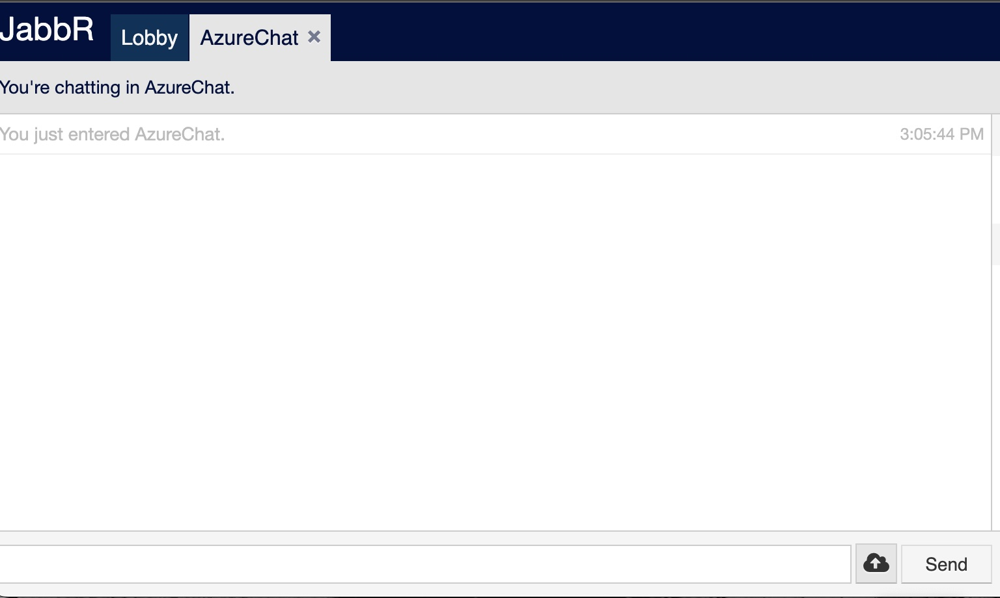
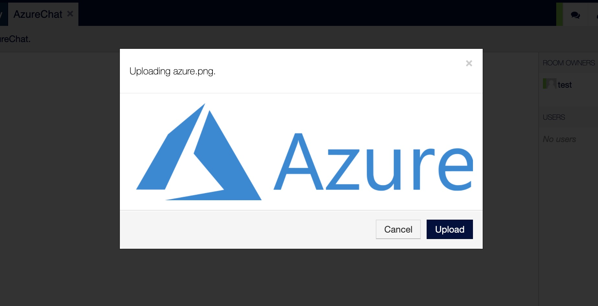
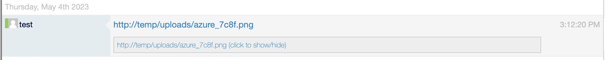
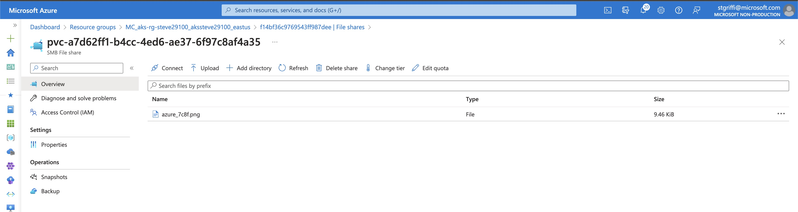

# Lab: Attaching Storage via Azure Container Storage Interface

When running workloads in Kubernetes the pod storage is ephemeral by default, meaning that when the pod is deleted any data persisted to the local filesystem of the pod is deleted. If you have a need to persist data beyond the lifetime of an individual pod, you will need to leverage a persistent volume. There are many options for persistent volumes, depending on your requirements, but the most commonly used are the [Azure Disk](https://learn.microsoft.com/en-us/azure/aks/azure-disk-csi) and [Azure Files](https://learn.microsoft.com/en-us/azure/aks/azure-files-csi) Container Storage Interface drivers. These drivers are installed by default in Azure Kubernetes Service and are ready to use.

In this lab we'll use the Azure Files CSI driver to mount a volume, shared across all pods in the deployment, which provides the persistent storage location for files uploaded to a chat session. 

>**Note:** For our purposes we'll be using the automated storage provisioning approach provided by the Azure CSI Drivers. It should be noted that you can also pre-create the storage accounts and use those from the [Azure Disk](https://learn.microsoft.com/en-us/azure/aks/azure-csi-disk-storage-provision) and [Azure Files](https://learn.microsoft.com/en-us/azure/aks/azure-csi-files-storage-provision) CSI drivers.

## Prerequisites

- Azure Account
- You should have completed the following labs and have a running instance of Jabbr:
  - [Local Developer Setup](../local-dev-setup/local-dev-setup.md)
  - [Build Application Container](../build-container/build-container.md)
  - [Create AKS Cluster](../create-aks-cluster/create-aks-cluster.md)
  - [Helm Setup and Deploy Application](../helm-setup-deploy/helm-setup-deploy.md)

## Instructions

1. In your [cloud shell](https://shell.azure.com), navigate to the helm chart directory

    ```bash
    cd aks-windows-workshop/src/chart/
    ```

1. Add a new file in the 'templates' folder named 'azure-files-pvc.yaml' with the following contents:

    ```yaml
    apiVersion: v1
    kind: PersistentVolumeClaim
    metadata:
    name: pvc-azurefile
    spec:
    accessModes:
        - ReadWriteMany
    resources:
        requests:
        storage: 100Gi
    storageClassName: azurefile-csi
    ```

1. Edit the 'deployment.yaml' file in the 'templates' folder

1. In the deployment.yaml file, add the following at the same level as 'containers', which will create the volume definition for the entire pod.

    ```yaml
    volumes:
      - name: persistent-storage
        persistentVolumeClaim:
          claimName: pvc-azurefile
    ```

1. Now add the volume mount reference to the jabbr container within the pod by adding the following inside the container definition, at the same level as 'ports'.

    ```yaml
    volumeMounts:
    - name: persistent-storage
      mountPath: "/upload"
    ```

1. When complete, your full deployment.yaml should look like the following:

    ```yaml
    apiVersion: apps/v1
    kind: Deployment
    metadata:
    name: "{{.Values.deploy.name}}"
    spec:
    selector:
        matchLabels:
        app: {{.Values.deploy.name}}
    template:
        metadata:
        labels:
            app: {{.Values.deploy.name}}
        spec:
        imagePullSecrets:
        - name: regcred
        containers:
            - image: "{{.Values.deploy.acr}}/jabbr:{{.Values.deploy.imageTag}}"
            imagePullPolicy: Always
            name: jabbr
            resources:
            env:
                - name: CONNSTR_Jabbr
                valueFrom:
                    secretKeyRef:
                    name: sql-db-conn-secret
                    key: connstr
            ports:
            - containerPort: {{.Values.deploy.containerPort}}
                protocol: TCP
            volumeMounts:
                - name: persistent-storage
                mountPath: "/upload"
        volumes:
            - name: persistent-storage
            persistentVolumeClaim:
                claimName: pvc-azurefile
        nodeSelector:
            "kubernetes.io/os": windows
        restartPolicy: Always
    ```

1. With the chart now updated it's time to run helm upgrade to update the deployment in the cluster.

    ```bash
    helm upgrade jabbr -n jabbr chart
    ```

1. Check to be sure the PVC has been created and is in a 'bound' state.

    ```bash
    kubectl get pvc -n jabbr

    # Sample Output
    NAME            STATUS   VOLUME                                     CAPACITY   ACCESS MODES   STORAGECLASS    AGE
    pvc-azurefile   Bound    pvc-a7d62ff1-b4cc-4ed6-ae37-6f97c8af4a35   100Gi      RWX            azurefile-csi   11m
    ```

1. Open up your Jabbr instance and navigate to the 'Settings' window by clicking on the gear in the top right of the screen.

    

1. Scroll down to the 'Local Storage' section and set the 'Local File System Storage Path' to the uploads directory we mounted our Azure Files PVC to. You also need to set a fake prefix path (ex. http://temp/uploads)

    

1. You should now be able to attach a file in a chat and see that file in Azure Files. Go to a chat room and click the upload icon, select a file and upload.

    

    

    

1. Now lets go see if the file was created. Since the Azure Storage Account and Files Container was created automatically, we need to go find those. We can get this information from the Persistent Volume Claim and associated Persistent Volume.

    ```bash
    # Get the persistent volume
    kubectl get pv -n jabbr

    # Sample output
    NAME                                       CAPACITY   ACCESS MODES   RECLAIM POLICY   STATUS   CLAIM                 STORAGECLASS    REASON   AGE
    pvc-a7d62ff1-b4cc-4ed6-ae37-6f97c8af4a35   100Gi      RWX            Delete           Bound    jabbr/pvc-azurefile   azurefile-csi            42m

    # Now get the details of the Persistent Volume. Specifically we want the VolumeHandle
    get pv  pvc-a7d62ff1-b4cc-4ed6-ae37-6f97c8af4a35 -n jabbr -o jsonpath='{.spec.csi.volumeHandle}'

    # Sample output
    mc_aks-rg-steve29100_akssteve29100_eastus#f14bf36c9769543ff987dee#pvc-a7d62ff1-b4cc-4ed6-ae37-6f97c8af4a35###jabbr
    ```

1. Seeing the above volume handle, we can find the storage location. 
   - The first part is the Resource Group: mc_aks-rg-steve29100_akssteve29100_eastus
   - The second part is the storage account name: f14bf36c9769543ff987dee
   - The thrid part is the Azure Files Storage Container: pvc-a7d62ff1-b4cc-4ed6-ae37-6f97c8af4a35


2. In the Azure Portal use the above information to navigate to the storage container

    