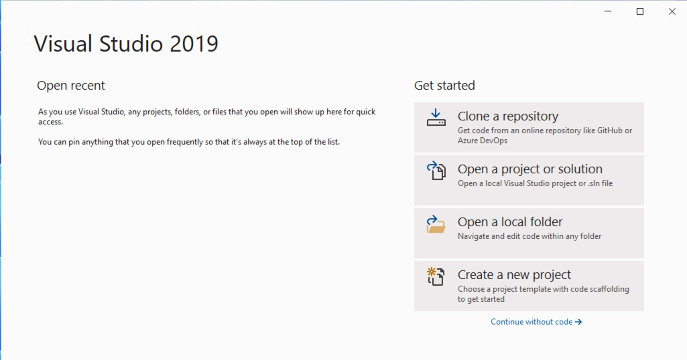
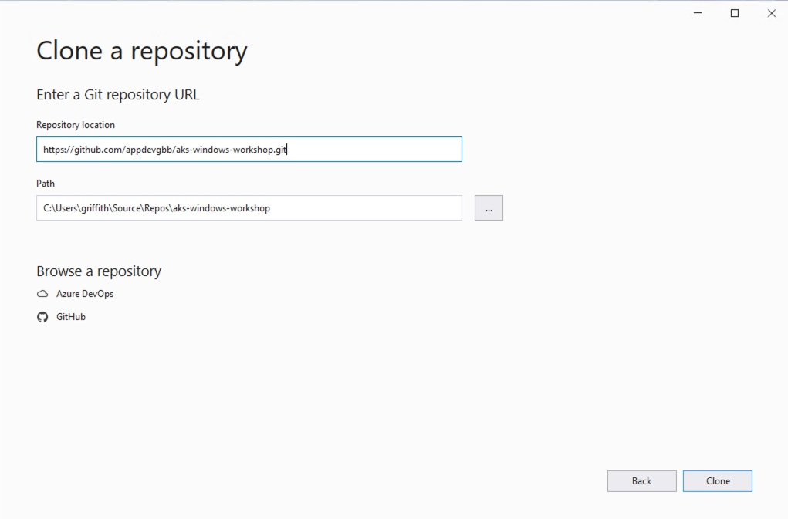
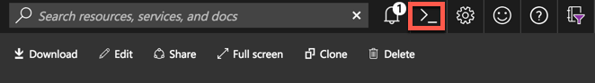
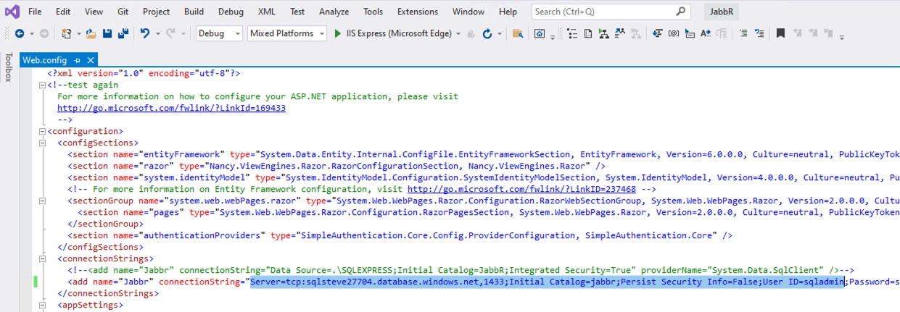
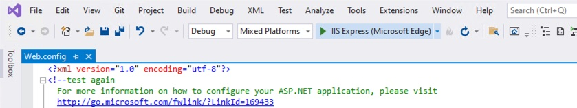
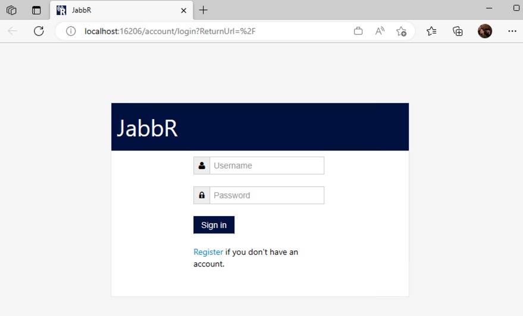
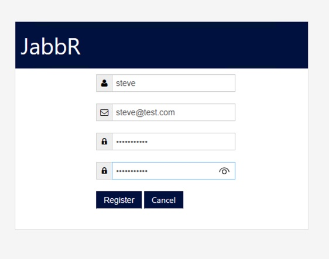
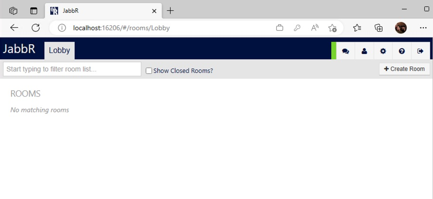
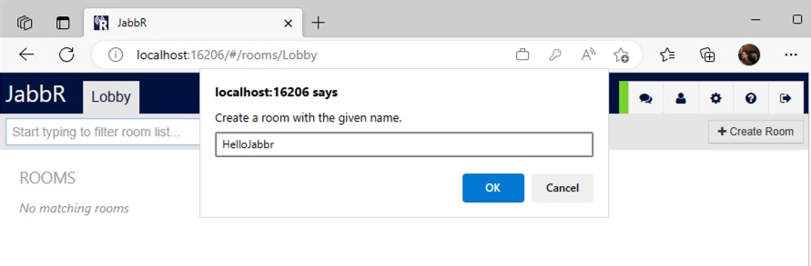
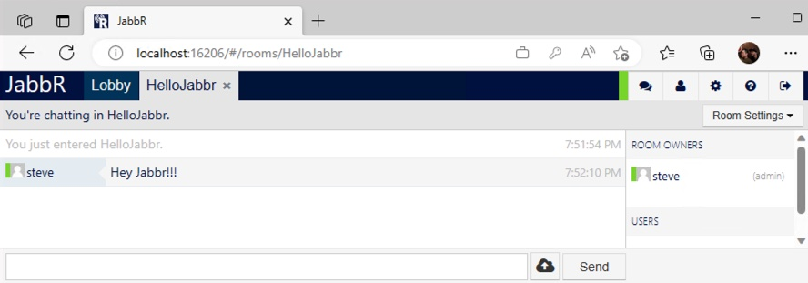

# Lab: Setup Local Developer Environment

In this lab we will clone the source code, create the data store and then build and run the Jabbr application.

## Prerequisites

- Azure Account
- [git](https://git-scm.com/book/en/v2/Getting-Started-Installing-Git)
- [Visual Studio 2019](https://visualstudio.microsoft.com/vs/older-downloads/)
- [.NET Framework 4.5](https://www.microsoft.com/en-us/download/details.aspx?id=30653)

### IMPORTANT NOTES:
* We'll be using Azure SQL DB, as we'll reuse the same data store later in the workshop. If you prefer, you can use SQL Express or your own SQL Server instance.
* We're using Visual Studio 2019 because our application is .Net Framework 4.5, which is not supported in VS 2022 without extensions. If you need to run in 2022, you can let Visual Studio upgrade the solution to Framework 4.8.

## Instructions

1. On the devloper machine clone the workshop repo
    
    Via CLI:
    ```bash
    git clone https://github.com/appdevgbb/aks-windows-workshop.git
    ```

    Via Visual Studio:

    

    
    
1. Login to Azure Portal at http://portal.azure.com.

1. Open the Azure Cloud Shell and choose Bash Shell (do not choose Powershell)

   

1. The first time Cloud Shell is started will require you to create a storage account.

1. Once your cloud shell is started, clone the workshop repo into the cloud shell environment

   ```bash
   git clone https://github.com/appdevgbb/aks-windows-workshop
   ```
   > Note: In the cloud shell, you are automatically logged into your Azure subscription.

1. Ensure you are using the correct Azure subscription you want to deploy to.

   ```
   # View subscriptions
   az account list
   ```

   ```
   # Verify selected subscription
   az account show -o yaml
   ```

   ```
   # Set correct subscription (if needed)
   az account set --subscription <subscription_id>

   # Verify correct subscription is now set
   az account show
   ```

1. Create a unique identifier suffix for resources to be created in this lab.

    > *NOTE:* In the following sections we'll be generating and setting some environment variables. If you're terminal session restarts you may need to reset these variables. You can use that via the following command:<br>
    source ~/workshopvars.env

    ```bash
    echo "# Start AKS Hackfest Lab Params">>~/workshopvars.env
    UNIQUE_SUFFIX=$USER$RANDOM
    
    # Remove Underscores and Dashes (Not Allowed in AKS and ACR Names)
    UNIQUE_SUFFIX="${UNIQUE_SUFFIX//_}"
    UNIQUE_SUFFIX="${UNIQUE_SUFFIX//-}"
    
    # Check Unique Suffix Value (Should be No Underscores or Dashes)
    echo $UNIQUE_SUFFIX
    
    # Persist for Later Sessions in Case of Timeout
    echo export UNIQUE_SUFFIX=$UNIQUE_SUFFIX >> ~/workshopvars.env
    ```

1. Create an Azure Resource Group in East US.

   ```bash
   # Set Resource Group Name using the unique suffix
   RGNAME=aks-rg-$UNIQUE_SUFFIX
   
   # Persist for Later Sessions in Case of Timeout
   echo export RGNAME=$RGNAME >> ~/workshopvars.env
   
   # Set Region (Location)
   LOCATION=eastus
   
   # Persist for Later Sessions in Case of Timeout
   echo export LOCATION=eastus >> ~/workshopvars.env
   
   # Create Resource Group
   az group create -n $RGNAME -l $LOCATION
   ```

1. Deploy Azure SQL DB

    In this step, create an Azure SQL DB for used by the application. Again, we will create a random, unique name.

    ```bash
    export SQLSERVERNAME=sql$UNIQUE_SUFFIX
    
    # Check SQL Server Name
    echo $SQLSERVERNAME
    
    # Persist for Later Sessions in Case of Timeout
    echo export SQLSERVERNAME=sql$UNIQUE_SUFFIX >> ~/workshopvars.env

    export SQLSERVERPASSWD=$UNIQUE_SUFFIX-passwd
    echo export SQLSERVERPASSWD=$UNIQUE_SUFFIX-passwd >> ~/workshopvars.env
    
    # Create SQL Server
    az sql server create --name $SQLSERVERNAME --resource-group $RGNAME --admin-user sqladmin --admin-password $SQLSERVERPASSWD

    # Create SQL DB
    az sql db create --resource-group $RGNAME --server $SQLSERVERNAME --name jabbr --edition GeneralPurpose
    az sql server firewall-rule create --resource-group $RGNAME --server $SQLSERVERNAME -n AllowYourIp --start-ip-address 0.0.0.0 --end-ip-address 0.0.0.0
    ```

    You can validate your Azure SQL DB instance in the portal.

1. Get the SQL Connection String

    ```bash
    # Get the SQL Server FQDN
    SQLFQDN=$(az sql server show -g $RGNAME -n $SQLSERVERNAME -o tsv --query fullyQualifiedDomainName)

    CONNSTR="Server=tcp:$SQLFQDN,1433;Initial Catalog=jabbr;Persist Security Info=False;User ID=sqladmin;Password=$SQLSERVERPASSWD;MultipleActiveResultSets=False;Encrypt=True;TrustServerCertificate=False;Connection Timeout=30;"

    echo $CONNSTR
    ```

1. Back in Visual Studio, open the web.config file and update the 'Jabbr' connection string to the value output from the 'echo' command above

    

1. Compile and run via IIS Express

    

    >Note: If you hit an invalid operation exception, you can continue

    

1. Register a test user:

    > **Warning**
    > This is NOT a security hardened application. Never use real user names and passwords.

    

    

    

    

## Conclusion

You should now have a working dev environment for Jabbr where you can play around and make code changes!

#### Next Lab: [.Net Portability Analysis](labs/portability-analysis/portability-analysis.md)