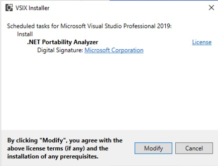

Pre-Reqs
VS2019
Excel (Optional)

INSTALL EXTENSION
RESTART VS
REOPEN SOLUTION
CONFIGURE ANALYZER
Run analyzer
Review Results

# Lab: .Net Portability Analysis

Before looking to containerize a .Net Framework application, it's a good idea to consider what options you have at your disposal. Modernizing an application doesn't mean it MUST go to containers. Often times a lot of benefit can be gained on supportability and features by upgrading the runtime version, or transitioning to another runtime. For example, there are a lot of benefits of moving to [dotnet core](https://dotnet.microsoft.com/en-us/download), including the fact that it's free and open source, and is portable across platforms (i.e. Mac, Windows and Linux).

Before we move forward with containerization, in this lab we'll take a look at the [.Net Portability Analyzer](https://learn.microsoft.com/en-us/dotnet/standard/analyzers/portability-analyzer) to understand what options we have for the Jabbr application.

## Prerequisites

- Visual Studio 2019
- Excel (Optional but preferred for viewing scan results)

## Instructions

The .Net Portability Analyizer is available as an extension to Visual Studio 2019, so the first thing we'll do is install the extension.

1. In Visual Studio 2019, go to 'Extensions' and then 'Manage Extensions'

    

1. In the right hand side, search for 'Portability' to find the extention. Click the 'Download' button.
   
    

1. The VSIX Installer window will pop up to prompt you to 'Modify' Visual Studio. Click 'Modify'. The installer will run.

    

    

1. In Visual Studio, go to 'Analyze' and then click on 'Portability Analyzer Settings'.

    

1. Edit the settings to chose what target platforms you want the analyzer to check against. In our case, we'll target with .NET Core 3.1 with platform extensions, as well as .Net Framework 4.8. We'll set the Output Format to include Excel, which gives an easy to read report.

    

1. In Visual Studio, click 'Analyze' and then 'Analyze Assembly Portability'.

    

1. In the dialog box, navigate to the bin directory, which holds the application assemblies. (./aks-windows-workshop/src/Jabbr/bin). Select all files in the bin directory and click 'Open'.

    

1. After the analysis completes, you should see the following dialog box appear to view the report. Click 'Open Report' on the ApiPortAnalysis.xlsx file.

    

1. Review the reportin Excel. Optionally, you can jump to the 'Details' tab and filter the report by the '.Net Core + Platform Extensions' column where the result is 'Not Supported' to see the full list.

    

    

## Conclusion

As you can see from the report results, a large portion of the application is portable to .Net Core, and almost the entire application can be upgraded to .Net Framework 4.8. In the real world, at this point, you would have a discussion as an organization about whether the investment in .Net Core upgrade makes sense or if staying with .Net Framework, with the possible upgrade to Framework 4.8 makes sense.

In our case, we'll assume that the effort, timelines and resource availability is such that porting to either .Net Core or Framework 4.8 is not an option at this time, so we'll proceed with containerization of the application as a .Net Framework 4.5 solution.

#### Next Lab: [Build the Application Container](../build-container/build-container.md)

